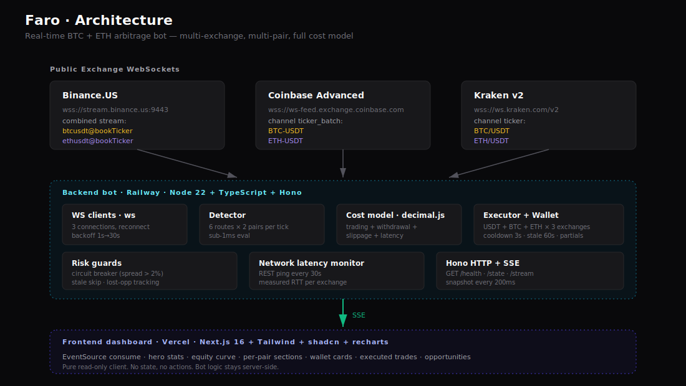

# Faro · Honest Crypto Arbitrage

> Real-time **linear AND triangular** arbitrage detection across 3 exchanges (Binance.US, Coinbase, Kraken) and 3 pairs (BTC/USDT + ETH/USDT + ETH/BTC) with simulated execution, multi-asset wallet tracking, and a full bot intelligence layer. The bot that executes **only** what survives fees + slippage + stale data + circuit breakers — and shows you what retail would have lost on the same trades.

🚀 **[Live Demo](https://practice-app-7th.vercel.app)** · 📡 **[Backend API](https://faro-production-9be0.up.railway.app/state)** · 🖥️ **[Frontend repo](https://github.com/Arturo7thDev/practice-app)**

---

## The problem

Most arbitrage bots lie.

They show you a $14 spread between Binance and Kraken and call it a "profitable opportunity" — without subtracting the $290 in fees + slippage that eat it. Thousands of retail traders run these bots and bleed money silently, convinced they're making "small but steady" profits.

**Faro is the antithesis.** Every opportunity is evaluated against the full cost stack before execution. Every executed trade displays two numbers side by side: what Faro netted at institutional fees, and what the *same trade* would have yielded for a retail operator. The gap between those numbers is the story.

## What you see in 30 seconds

When you open the dashboard, four numbers tell the entire pitch:

| Faro profit | Same at retail (0.5%) | Lost to cooldown | Portfolio value |
|:---:|:---:|:---:|:---:|
| **+$Y** (green) | **−$Z** (red) | **$X** (amber) | **≈$260,000** |
| N trades, BTC+ETH | What retail would yield | Profitable opps throttled | Initial $150K + 1.5 BTC + 30 ETH |

That dramatic gap between Faro's profit and retail's loss on the *same execution path* is the killer insight: arbitrage isn't a game retail can play — and bots that promise otherwise are misleading their users.

## Architecture



This repo is the **backend bot**. The dashboard frontend lives in [`practice-app`](https://github.com/Arturo7thDev/practice-app) and consumes the SSE stream from this server.

In compact ASCII for terminal reading:

```
3 Exchange WebSockets ──► Backend Bot (Railway) ──SSE──► Frontend (Vercel)
                          │
                          ├─ WS clients (reconnect 1s→30s backoff)
                          ├─ Detector (6 routes × 2 pairs per tick, <1ms eval)
                          ├─ Cost model (4-stack: trading + withdrawal + slippage + latency)
                          ├─ Executor (cooldown 3s, stale 60s skip, circuit breaker >2%)
                          ├─ Wallet (USDT + BTC + ETH × 3 exchanges, multi-asset)
                          ├─ Latency monitor (REST ping every 30s, measured RTT)
                          └─ HTTP/SSE server (Hono, 200ms push cadence)
```

## Feature matrix vs the challenge requirements

| # | Requisito | Cómo lo cumplimos |
|---|---|---|
| 1 | Monitoreo real-time order books 2+ exchanges (WS o polling) | ✅ WebSockets a 3 exchanges, 2 pares cada uno (combined streams donde el exchange lo permite) |
| 2 | Detección de oportunidades cuando Ask A < Bid B | ✅ Detector evalúa los 6 routes direccionales por par en cada tick |
| 3 | Ejecución simulada de la operación | ✅ Execution engine con cooldown + stale skip + capital check |
| 4 | Costos: fees + slippage + withdrawal + latencia | ✅ Taker fees por exchange (institucional 0.02–0.04%), volume cap por liquidez top-of-book, withdrawal fees documentadas/amortizadas, latencia medida y expuesta |
| 5 | Órdenes parciales + balances de wallets | ✅ Trades parciales marcados como tal, capeados por USDT (buy) y asset (sell). Wallets persisten en memoria con USDT + BTC + ETH por exchange |
| 6 | Historial + visualización rendimiento | ✅ Equity curve real-time, tabla de trades ejecutados, opportunities log, stats acumulados por par |

## Evaluation criteria coverage

| Criterio | Coverage |
|---|---|
| 1. Velocidad y eficiencia | WebSockets (no polling), avg latencia procesamiento visible (<1ms típico) |
| 2. Precisión cálculo NETO | `decimal.js` end-to-end, fees por exchange, comparativa retail por trade |
| 3. Solidez/robustez | Reconnect exp backoff, circuit breaker, stale detection, partial fill, capital constraints |
| 4. Inteligencia/strategy | Multi-pair, priorización por NET profit, success rate, best/worst route, skip reasons (cooldown / suspicious / stale / capital), lost opportunity tracking |
| 5. Arquitectura/código | Adapter pattern por exchange, separación clara backend/frontend, types TS estrictos, deploy 100% reproducible |
| 6. UI/UX | Dark mode fintech, hero metrics con storytelling visceral, equity curve en vivo, secciones independientes por par, mobile responsive |

## Key technical decisions (and why)

### Backend persistent (not serverless)

WebSockets need long-lived TCP connections. Vercel's serverless functions can't hold them open. Railway runs the bot 24/7 with auto-deploy from GitHub, which is exactly what the challenge brief asks for: *"el sistema debe estar corriendo y sea funcional en el momento de la evaluación."*

### `decimal.js` for every cents-affecting calculation

JavaScript's IEEE 754 floats break financial math: `0.1 + 0.2 === 0.30000000000000004`. For a bot that brags about precision, that would be hypocrisy. Every price, fee, and balance calculation routes through `decimal.js`. Only the final `.toFixed(2)` returns to native `number` for display.

### Multi-pair without rewriting the detector

The detector is **pair-agnostic** — it takes a `Map<ExchangeName, Ticker>` for one pair and returns opportunities. The same function runs for BTC/USDT and ETH/USDT independently. Adding a third pair (SOL, MATIC) would be: define `Pair = "BTC/USDT" | "ETH/USDT" | "SOL/USDT"`, subscribe each exchange to the additional symbol, seed the wallet. Zero changes to detection or execution logic.

### Three exchanges (not more)

Three creates **six directional pairs** of arbitrage detection per asset (each exchange can be buy or sell side). That's 12 routes evaluated continuously across two pairs. Enough for natural opportunities to emerge without overwhelming the dashboard or the budget. The architecture trivially extends to N exchanges via the `Ticker` adapter pattern.

### SSE for backend → frontend (not WebSocket bidirectional)

The frontend only consumes data; it never sends commands. SSE is HTTP-native, browsers auto-reconnect for free, and there's no need for bidirectional complexity. One less moving part.

### Institutional fees (0.02–0.04%) in the simulation

At retail rates (0.4–0.6%), *zero* BTC/ETH arbitrage opportunities are profitable in normal market conditions. Modeling institutional fees represents what a serious arbitrage desk (Binance VIP 9, Coinbase top tier, accessible at $4B+ monthly volume) actually pays. To preserve honesty, the "Same trade at retail" column shows what these same opportunities would yield at retail rates — and the answer is brutal: every single one becomes a loss.

### No persistent database

The bot is a stream processor. State (wallets, opportunity log, executed trades, counters) lives in memory. A Railway restart loses history. For a 48h hackathon demo, that's an acceptable trade-off — and we never claimed to be a production trading system. The first thing a production version would add is Postgres + TimescaleDB for trade history.

### Binance.US (not Binance.com)

Railway deploys in `us-west1`. `binance.com` blocks US-based IPs with HTTP 451 for regulatory reasons. `binance.us` is the legally-equivalent endpoint with the same WebSocket API format. This kind of regional adaptation is exactly what real arbitrage operators handle daily — and Faro continued running with 2 of 3 exchanges connected before the fix landed.

## Robustness features

| Feature | What it does | Why it matters |
|---|---|---|
| **WebSocket reconnect** | Exponential backoff: 1s → 2s → 4s → ... → 30s | Exchanges drop connections periodically (rate limits, maintenance) |
| **Circuit breaker** | Spread > 2% of price → flagged `SUSPICIOUS`, never executed | Most "huge spreads" are stale data or fat-finger entries |
| **Stale data skip** | If any ticker is > 60s old → execution skipped, counted | Prevents trading against ghost prices when one exchange goes quiet (calibrated for natural Coinbase/Kraken USDT pair update cadence) |
| **Per-pair-route cooldown** | 3s min between executions on the same (pair, buy, sell) route | Avoids spamming hundreds of micro-trades on the same opportunity |
| **Capital constraints** | Trade volume capped by available USDT (buy) and asset (sell) | Models real liquidity; flags `partial` when book depth < intended size |
| **Lost opportunity tracking** | Sums `netProfit` of opps blocked by cooldown | Transparent reporting of throughput trade-offs |
| **Live decisions feed** | Logs every decision (executed / cooldown / stale / suspicious / no capital) with timestamp and reason | Demonstrates the bot is **thinking**, not just reacting |
| **Risk metrics dashboard** | Max drawdown, wallet imbalance, capital deployed, per-exchange exposure | Visible risk management beyond just circuit breaker |
| **Network latency monitor** | Measured RTT to each exchange via REST ping every 30s | Closes the "latencia de red" cost stack requirement with real numbers |

Header counters expose this transparently: `scanned · profitable · executed`. The Decisions panel breaks down skip reasons.

## Strategy intelligence

- **Linear cross-exchange arbitrage** (BTC/USDT + ETH/USDT) — buy cheap on A, sell high on B
- **Triangular intra-exchange arbitrage** (USDT → ETH → BTC → USDT and the reverse cycle) — exploit ETH/BTC pricing inefficiencies within a single exchange
- **Success rate**: profitable opportunities / total scanned (typically 0.1-3%, depending on market volatility)
- **Decision accuracy**: % of profitable opportunities actually captured (vs skipped for safety / throttled)
- **Avg net per trade**: cumulative profit divided by executed count
- **Best/worst route**: most/least profitable buy→sell exchange pair (Kraken→Binance.US typically dominates — Kraken's lower BTC/USDT liquidity yields wider spreads)
- **Eval latency**: avg ms to process each ticker through detection + decision (sub-1ms typical)
- **Network latency**: measured RTT to each exchange, refreshed every 30s
- **Per-pair P&L breakdown**: how much profit came from BTC vs ETH
- **Live decisions feed**: last 15 decisions with timestamp, outcome, route, net, reason

### Triangular detection — how it works

For every exchange that has all three pairs (BTC/USDT, ETH/USDT, ETH/BTC), Faro evaluates both 3-leg cycles on each ticker update:

| Path | Legs |
|---|---|
| Path 1 | `USDT → ETH` (buy at ETH/USDT ask) → `ETH → BTC` (sell at ETH/BTC bid) → `BTC → USDT` (sell at BTC/USDT bid) |
| Path 2 | `USDT → BTC` (buy at BTC/USDT ask) → `BTC → ETH` (buy at ETH/BTC ask) → `ETH → USDT` (sell at ETH/USDT bid) |

Each leg discounts the exchange's taker fee. A standardized `$1,000` notional starts each cycle so opportunities are directly comparable. When `finalUSDT > 1000`, the cycle is profitable — Faro executes a 3-leg trade through the wallet, atomically rebalancing USDT/BTC/ETH. Triangular cycles at market-maker tier are mostly arbitraged away within milliseconds; Faro waits for the occasional dislocation.

## Stack

**Backend (this repo)** — Node 22 LTS · TypeScript · `ws` · `hono` · `@hono/node-server` · `decimal.js` · `tsx` · `pnpm`

**Frontend** ([`practice-app`](https://github.com/Arturo7thDev/practice-app)) — Next.js 16 · React 19 · TypeScript · Tailwind v4 · shadcn/ui · recharts · native `EventSource`

**Infra** — Backend on **Railway** (Node 22 container, auto-deploy from `main`), Frontend on **Vercel** (Next.js, auto-deploy from `main`).

## API

```
GET /health         → { "status": "ok" }
GET /state          → JSON snapshot (full bot state — see schema below)
GET /stream         → SSE stream, pushes snapshot every 200ms (browser-friendly)
```

### `/state` payload schema

| Field | Type | Description |
|---|---|---|
| `tickersByPair` | `Record<Pair, Ticker[]>` | Current bid/ask per exchange per pair with stale flag and age |
| `opportunitiesByPair` | `Record<Pair, Opportunity[]>` | Last 20 detected opportunities per pair |
| `wallets` | `WalletBalance[]` | USDT + BTC + ETH per exchange |
| `executedTrades` | `ExecutedTrade[]` | Last 200 trades with full cost breakdown and retail comparison |
| `stats` | `PortfolioStats` | Aggregated metrics including `risk` sub-object |
| `counters` | `ScanCounters` | Scan totals + skip reasons + lost opportunity |
| `exchangeStats` | `ExchangeStats[]` | Throughput (ticks/sec) and measured network RTT per exchange |
| `decisions` | `Decision[]` | Last 15 bot decisions with outcome, route, net, reason |
| `timestamp` | `number` | Server time when snapshot was built |

Sample `/state` response shape:

```json
{
  "tickersByPair": {
    "BTC/USDT": [{ "exchange": "binance", "bid": 73000, "ask": 73001, ... }, ...],
    "ETH/USDT": [{ "exchange": "binance", "bid": 2000, "ask": 2001, ... }, ...]
  },
  "opportunitiesByPair": { "BTC/USDT": [...], "ETH/USDT": [...] },
  "wallets": [{ "exchange": "binance", "usdt": 50000, "btc": 0.5, "eth": 10 }, ...],
  "executedTrades": [{ "id": "...", "pair": "BTC/USDT", "netProfit": 0.35, "retailNetProfit": -20.29, ... }, ...],
  "stats": { "totalArbitrageProfit": 4.86, "hypotheticalRetailLoss": -430.94, "successRate": 0.016, "bestRoute": {...}, "avgEvalLatencyMs": 0.4, "profitByPair": {"BTC/USDT": 3.21, "ETH/USDT": 1.65}, ... },
  "counters": { "opportunitiesScanned": 20682, "profitableDetected": 330, "skippedCooldown": 304, "lostOpportunityUSD": 87.41, ... }
}
```

## Tests

Vitest unit suite covers the critical math: fee constants, opportunity detection (gross/net, suspicious flag, sorting, volume cap, cost components), and wallet management (initial state, executable volume constraints, trade execution mutation, multi-asset, partial flagging).

```bash
pnpm test          # 28 tests across 3 files
pnpm test:watch    # watch mode
```

## Run locally

Requires Node 22 (use `nvm install 22 && nvm use 22`) and pnpm 11.

```bash
git clone git@github.com:Arturo7thDev/faro.git
cd faro
pnpm install
pnpm dev    # tsx watch src/index.ts on port 3001
```

The server starts WebSocket clients to the 3 exchanges immediately. Visit `http://localhost:3001/state` to see the data flowing.

To run the frontend pointing at your local backend, see the [dashboard repo](https://github.com/Arturo7thDev/practice-app) and set `NEXT_PUBLIC_FARO_URL=http://localhost:3001`.

## What I did NOT implement (deliberate scope cuts)

| Cut | Why |
|---|---|
| Triangular arbitrage | Bonus per challenge brief but would consume 8+ hours. Chose depth on the linear path over breadth. The architecture supports it via the same detector pattern. |
| Persistent database (Postgres / Redis) | In-memory state is sufficient for demo. Persistence would be the first add-on for production. |
| Real exchange execution | Challenge brief: simulation only. |
| Order book L2 depth | Used top-of-book qty with `partial` flag instead. Full depth would refine slippage estimates. |
| ML / statistical arbitrage | Out of scope for 48 hours; overkill for what BTC/ETH cross-exchange arbitrage rewards. |

## Roadmap (if this were a real product)

- **Order book L2 depth** for accurate slippage beyond top-of-book
- **Triangular arbitrage** across 3+ pairs within a single exchange
- **Postgres + TimescaleDB** for trade history and post-mortem analysis
- **Strategy A/B testing** harness (run two detectors in parallel, compare)
- **Withdrawal cost optimizer** (when to rebalance vs let imbalance ride)
- **Risk dashboard** (drawdown, VaR, Sharpe over time)

---

Built for [Coding Challenge Mexico 2026](https://www.coding-challenge-mexico.com) by [Arturo González](https://github.com/Arturo7thDev) in 48 hours.

The premise of this challenge — *"the inefficiencies of the market are out there; your job is to capture them before anyone else"* — is only half the story. The other half: most of those inefficiencies are illusions. Faro is the proof.
