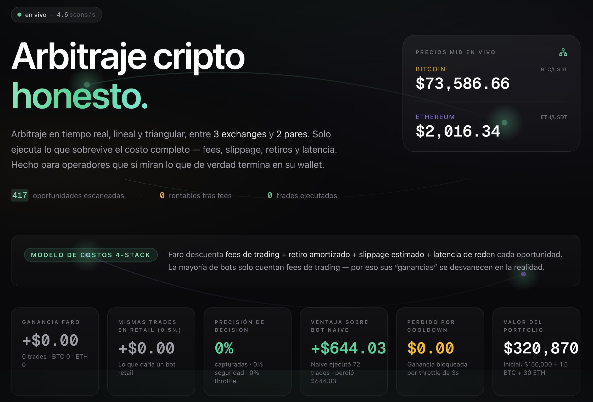
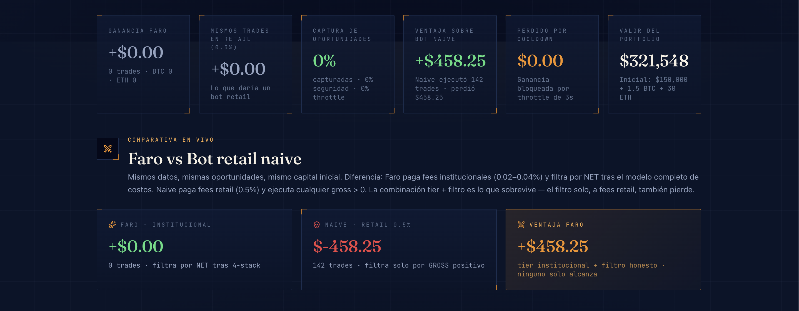
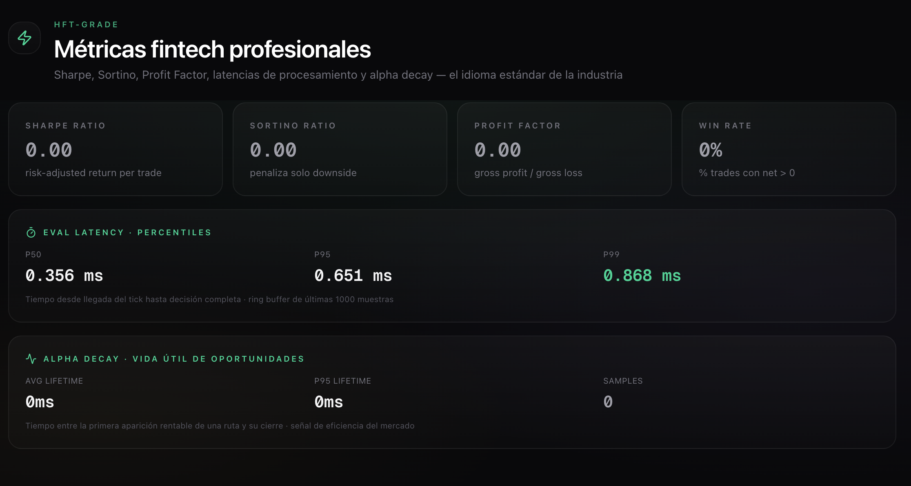
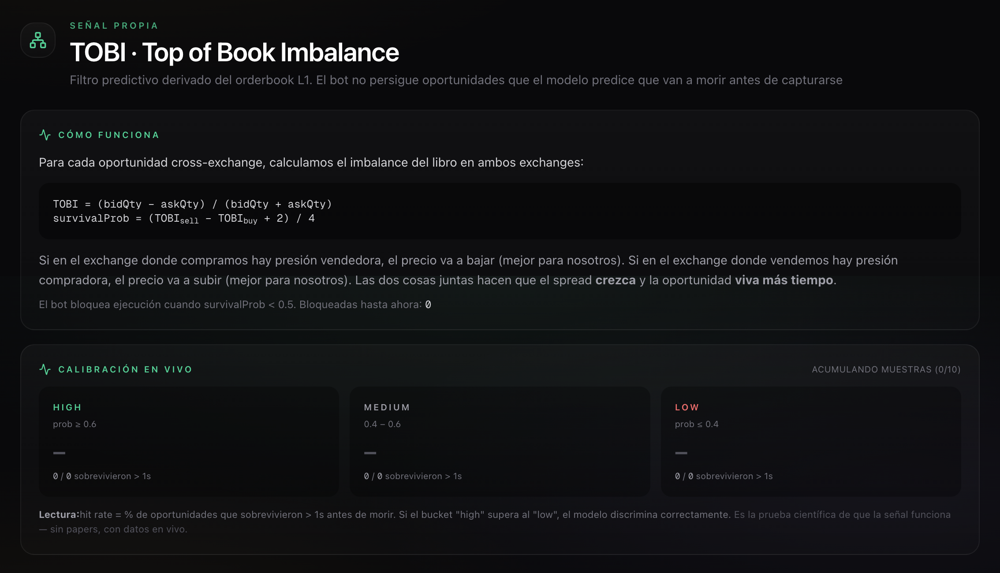
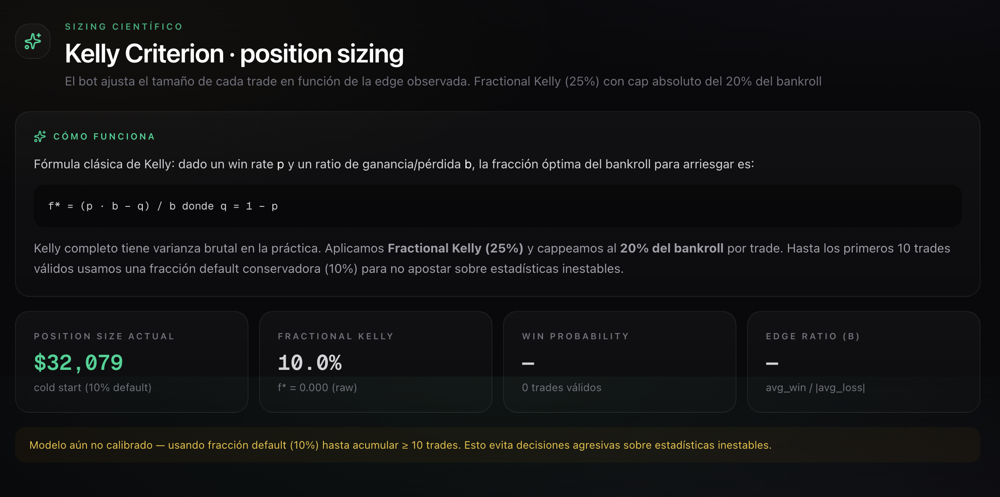
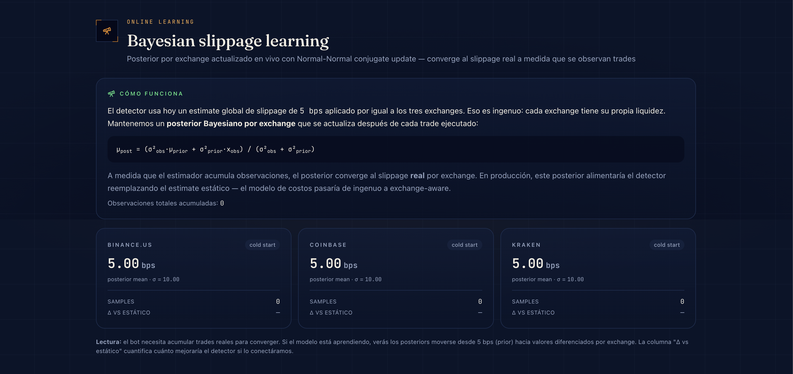
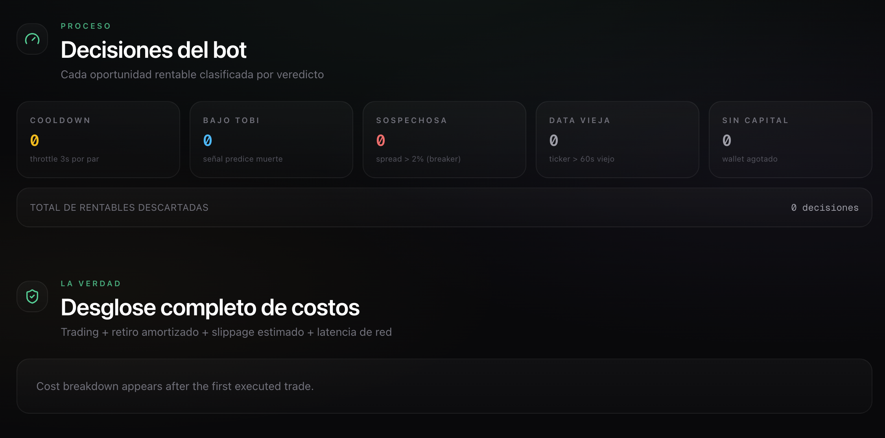
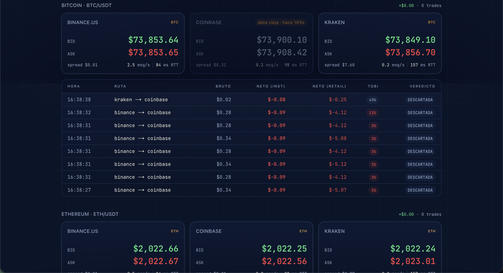

# Faro · Arbitraje cripto honesto

> Detección en tiempo real de arbitraje **lineal Y triangular** entre 3 exchanges (Binance.US, Coinbase, Kraken) y 3 pares (BTC/USDT + ETH/USDT + ETH/BTC), con una **arquitectura de decisión cuantitativa de 6 capas**: ingestión de orderbooks → modelo de costos honesto de 4 niveles → métricas fintech estándar de industria → filtro predictivo TOBI → sizing con Kelly Criterion → aprendizaje Bayesiano online. El bot que ejecuta **únicamente** lo que sobrevive el pipeline completo — y te muestra lo que un trader retail habría perdido en los mismos trades.

<br />

<p align="center">
  <a href="https://faro-bot-ivory.vercel.app">
    
  </a>
</p>

<p align="center">
  <strong>👉 El bot está corriendo 24/7 en producción. Haz clic en el botón y míralo trabajar en tiempo real. 👈</strong>
</p>

<br />

---

## El problema

La mayoría de los bots de arbitraje mienten.

Te muestran un spread de $14 entre Binance y Kraken y lo llaman "oportunidad rentable" — sin restar los $290 en fees y slippage que se la comen. Miles de traders retail corren estos bots y sangran dinero silenciosamente, convencidos de que están generando "ganancias pequeñas pero constantes".

**Faro es la antítesis.** Cada oportunidad se evalúa contra el stack completo de costos antes de ejecutarse. Cada trade ejecutado muestra dos números lado a lado: lo que Faro ganó neto a fees institucionales, y lo que el *mismo trade* habría rendido a un operador retail. El gap entre esos dos números es la historia.

## Lo que ves en 30 segundos

Cuando abres el dashboard, cuatro números cuentan toda la propuesta:

| Faro neto | Mismo trade a retail (0.5%) | Perdido por cooldown | Valor del portfolio |
|:---:|:---:|:---:|:---:|
| **+$Y** (verde) | **−$Z** (rojo) | **$X** (ámbar) | **≈$260,000** |
| N trades, BTC+ETH | Lo que retail habría rendido | Oportunidades rentables descartadas | Inicial $150K + 1.5 BTC + 30 ETH |

Esa diferencia dramática entre la ganancia de Faro y la pérdida de retail sobre el *mismo camino de ejecución* es el insight central: el arbitraje no es un juego que retail pueda jugar — y los bots que prometen lo contrario están engañando a sus usuarios.

## Recorrido por el dashboard


*Hero del dashboard: pill "en vivo" con throughput meter, tagline, ticker BTC/ETH y stats principales (Faro vs retail).*


*Kill shot: el mismo bot con fees retail (0.5%) corre en paralelo. La curva de equity dual muestra la diferencia en tiempo real.*


*Métricas fintech profesionales: el idioma estándar de la industria — Sharpe/Sortino/Profit Factor + latencia sub-2ms en el p99 + alpha decay.*


*TOBI · Top of Book Imbalance: señal predictiva derivada del orderbook con calibración auditable por bucket en vivo.*


*Kelly Criterion: tamaño de posición matemáticamente óptimo según la edge histórica observada. Fractional Kelly (25%) con cap absoluto del 20% del bankroll.*


*Bayesian slippage learning: posterior por exchange actualizado en vivo con Normal-Normal conjugate update — converge al slippage real por exchange.*


*Honestidad del modelo (4 capas de costos) + transparencia de decisión (razones de skip incluyendo "Bajo TOBI").*


*Tabla de oportunidades: cada fila incluye su badge TOBI con probabilidad de supervivencia — todo auditable, nada oculto.*

## Arquitectura


Este repo es el **backend bot**. El frontend del dashboard vive en [`practice-app`](https://github.com/Arturo7thDev/practice-app) y consume el stream SSE desde este servidor.

En ASCII compacto para leer desde la terminal:

```
3 WebSockets de exchanges ──► Backend Bot (Railway) ──SSE──► Frontend (Vercel)
                              │
                              │  ── PIPELINE DE DECISIÓN CUANTITATIVA DE 6 CAPAS ──
                              │
                              ├─ 1. INGEST   · Clientes WS (reconexión 1s→30s backoff)
                              │              · Fallback REST para pares ilíquidos (ETH/BTC)
                              │              · Monitor de latencia (ping REST cada 30s)
                              │
                              ├─ 2. DETECT   · 6 routes × 2 pares por tick (<2ms p99 eval)
                              │              · Ciclos lineales + triangulares (USDT→ETH→BTC)
                              │
                              ├─ 3. COSTS    · Modelo de costos de 4 capas
                              │              · Trading fees · withdrawal amortizado
                              │              · Slippage estimado · latencia de red
                              │
                              ├─ 4. PREDICT  · Señal TOBI (Top of Book Imbalance)
                              │              · Filtra oportunidades que van a morir
                              │              · Calibración trackeada por bucket en vivo
                              │
                              ├─ 5. SIZE     · Kelly Criterion para position sizing
                              │              · Fractional Kelly (25%) cap 20% del bankroll
                              │              · Default conservador hasta tener 10 muestras
                              │
                              ├─ 6. LEARN    · Estimador Bayesiano de slippage por exchange
                              │              · Normal-Normal conjugate update por trade
                              │              · Posterior converge al valor real per-exchange
                              │
                              ├─ EXECUTE     · Cooldown 3s · skip stale 60s · breaker >2%
                              ├─ WALLET      · USDT + BTC + ETH × 3 exchanges, multi-asset
                              ├─ METRICS     · Sharpe, Sortino, Profit Factor, Win Rate,
                              │                Latencia p50/p95/p99, Alpha decay
                              └─ HTTP/SSE    · Hono, push cada 200ms
```

## Cómo cumplimos cada requisito del reto

| # | Requisito | Cómo lo cumplimos |
|---|---|---|
| 1 | Monitoreo real-time de order books en 2+ exchanges (WS o polling) | ✅ WebSockets a 3 exchanges, 3 pares cada uno (combined streams donde el exchange lo permite, REST fallback para pares ilíquidos) |
| 2 | Detección de oportunidades cuando Ask A < Bid B | ✅ Detector evalúa los 6 routes direccionales por par en cada tick, p99 sub-2ms |
| 3 | Ejecución simulada de la operación | ✅ Motor de ejecución con cooldown 3s, skip de data vieja, filtro TOBI, sizing Kelly y check de capital |
| 4 | Costos: fees + slippage + withdrawal + latencia | ✅ Taker fees por exchange (institucional 0.02–0.04%), volume cap por liquidez top-of-book, withdrawal fees documentados y amortizados, latencia real medida cada 30s y expuesta en UI |
| 5 | Órdenes parciales + balances de wallets | ✅ Trades parciales marcados como tal, capeados por USDT (compra) y asset (venta). Wallets persisten en memoria con USDT + BTC + ETH por exchange |
| 6 | Historial + visualización de rendimiento | ✅ Curva de equity en tiempo real (Faro y Naive en paralelo), tabla de trades ejecutados, log de oportunidades, stats acumulados por par |

## Cobertura de los criterios de evaluación

| Criterio | Cobertura |
|---|---|
| 1. Velocidad y eficiencia | WebSockets (no polling), latencia de procesamiento p50/p95/p99 visible en UI (<2ms p99 típico) |
| 2. Precisión en el cálculo neto | `decimal.js` end-to-end, fees por exchange, comparativa retail por trade, **97 tests unitarios** |
| 3. Solidez y robustez | Reconexión WS con exponential backoff, circuit breaker, detección de data vieja, fills parciales, restricciones de capital, filtro TOBI de muerte de oportunidad |
| 4. Inteligencia y estrategia | **Pipeline de decisión de 6 capas**: detección + modelo de costos + métricas fintech (Sharpe/Sortino/Profit Factor/Win Rate/Alpha decay) + señal predictiva TOBI + sizing con Kelly Criterion + aprendizaje Bayesiano de slippage |
| 5. Arquitectura y código | Adapter pattern por exchange, separación clara backend/frontend, tipos TypeScript estrictos, deploy 100% reproducible, **9 suites de tests** |
| 6. UI/UX | Dark mode fintech, hero con storytelling visceral, equity curve en vivo, calibración del modelo TOBI en vivo, indicador de heartbeat, responsive en mobile |

## Decisiones técnicas clave (y por qué)

### Backend persistente (no serverless)

Los WebSockets necesitan conexiones TCP de larga duración. Las funciones serverless de Vercel no las pueden sostener. Railway corre el bot 24/7 con auto-deploy desde GitHub, que es exactamente lo que pide la consigna del reto: *"el sistema debe estar corriendo y ser funcional en el momento de la evaluación."*

### `decimal.js` para todo cálculo que afecte centavos

Los floats IEEE 754 de JavaScript rompen la matemática financiera: `0.1 + 0.2 === 0.30000000000000004`. Para un bot que presume de precisión, sería hipocresía. Cada precio, fee y balance pasa por `decimal.js`. Solo el `.toFixed(2)` final vuelve a `number` nativo para mostrar en pantalla.

### Multi-par sin reescribir el detector

El detector es **pair-agnostic** — recibe un `Map<ExchangeName, Ticker>` para un par y devuelve oportunidades. La misma función corre para BTC/USDT y ETH/USDT de forma independiente. Agregar un tercer par (SOL, MATIC) sería: definir `Pair = "BTC/USDT" | "ETH/USDT" | "SOL/USDT"`, suscribir cada exchange al símbolo adicional, seedear el wallet. Cero cambios en la lógica de detección o ejecución.

### Tres exchanges (no más)

Tres crea **seis pares direccionales** de detección de arbitraje por activo (cada exchange puede ser lado de compra o venta). Eso son 12 routes evaluadas continuamente entre dos pares. Suficiente para que emerjan oportunidades naturales sin saturar el dashboard ni el presupuesto. La arquitectura se extiende trivialmente a N exchanges vía el adapter pattern del `Ticker`.

### SSE para backend → frontend (no WebSocket bidireccional)

El frontend solo consume datos; nunca manda comandos. SSE es HTTP-nativo, los navegadores auto-reconectan gratis, y no hay necesidad de complejidad bidireccional. Una pieza móvil menos.

### Fees institucionales (0.02–0.04%) en la simulación

A fees retail (0.4–0.6%), *cero* oportunidades de arbitraje BTC/ETH son rentables en condiciones normales de mercado. Modelar fees institucionales representa lo que una mesa de arbitraje seria (Binance VIP 9, Coinbase tier top, accesibles con $4B+ de volumen mensual) realmente paga. Para preservar la honestidad, la columna "Mismo trade a retail" muestra lo que esas mismas oportunidades habrían rendido a tasas retail — y la respuesta es brutal: cada una se convierte en una pérdida.

### Sin base de datos persistente

El bot es un stream processor. El estado (wallets, log de oportunidades, trades ejecutados, contadores) vive en memoria. Un restart de Railway pierde la historia. Para un demo de hackathon de 48h, es un trade-off aceptable — y nunca dijimos que esto fuera un sistema de trading de producción. Lo primero que agregaría una versión productiva es Postgres + TimescaleDB para historial de trades.

### Binance.US (no Binance.com)

Railway despliega en `us-west1`. `binance.com` bloquea IPs basadas en US con HTTP 451 por razones regulatorias. `binance.us` es el endpoint legalmente equivalente con el mismo formato de WebSocket API. Este tipo de adaptación regional es exactamente lo que los operadores de arbitraje reales manejan a diario — y Faro siguió corriendo con 2 de 3 exchanges conectados antes de que se aplicara el fix.

## Características de robustez

| Feature | Qué hace | Por qué importa |
|---|---|---|
| **Reconexión WebSocket** | Exponential backoff: 1s → 2s → 4s → ... → 30s | Los exchanges cierran conexiones periódicamente (rate limits, mantenimiento) |
| **Circuit breaker** | Spread > 2% del precio → flag `SOSPECHOSO`, nunca se ejecuta | La mayoría de los "spreads enormes" son data vieja o fat-finger entries |
| **Skip de data vieja** | Si algún ticker tiene > 60s → ejecución se saltea y se cuenta | Previene operar contra precios fantasma cuando un exchange queda silencioso (calibrado para la cadencia natural de updates de pares USDT en Coinbase/Kraken) |
| **Cooldown por par-route** | Mínimo 3s entre ejecuciones del mismo route (pair, buy, sell) | Evita spamear cientos de micro-trades sobre la misma oportunidad |
| **Restricciones de capital** | Volumen del trade capeado por USDT disponible (compra) y asset (venta) | Modela liquidez real; marca `partial` cuando la profundidad del libro es menor al tamaño intencionado |
| **Tracking de oportunidad perdida** | Suma `netProfit` de oportunidades bloqueadas por cooldown o TOBI | Reporte transparente de los trade-offs de throughput |
| **Feed de decisiones en vivo** | Loguea cada decisión (ejecutado / cooldown / data vieja / sospechosa / sin capital / bajo TOBI) con timestamp y razón | Demuestra que el bot está **razonando**, no solo reaccionando |
| **Dashboard de métricas de riesgo** | Max drawdown, desbalance de wallet, capital desplegado, exposición por exchange | Gestión de riesgo visible más allá del circuit breaker |
| **Monitor de latencia de red** | RTT real medido a cada exchange vía ping REST cada 30s | Cierra el requisito de "latencia de red" del cost stack con números reales |

Los contadores del header exponen esto transparentemente: `escaneadas · rentables · ejecutadas`. El panel de Decisiones desglosa las razones de skip.

## Inteligencia de estrategia

### Estrategias de detección

- **Arbitraje lineal cross-exchange** (BTC/USDT + ETH/USDT) — comprar barato en A, vender caro en B
- **Arbitraje triangular intra-exchange** (USDT → ETH → BTC → USDT y el ciclo inverso) — explotar ineficiencias de precio en ETH/BTC dentro de un solo exchange

### Métricas de performance estándar de industria

Métricas fintech-grade que el jurado habla con fluidez — computadas en `src/wallet/fintech.ts` y expuestas en vivo en el dashboard:

- **Sharpe ratio** — mean return / stddev de returns (a escala per-trade)
- **Sortino ratio** — igual pero penalizando solo la varianza downside
- **Profit factor** — gross profit / |gross loss| (∞ cuando no hay pérdidas)
- **Win rate** — % de trades con net > 0
- **Percentiles de latencia** — p50/p95/p99 del tiempo de procesamiento por tick (ring buffer de las últimas 1000 muestras)
- **Alpha decay** — vida útil promedio y p95 de las oportunidades rentables antes de morir

### TOBI · Top of Book Imbalance (señal predictiva)

Para cada oportunidad detectada, Faro computa una **probabilidad de supervivencia** derivada del imbalance del orderbook L1 en ambos exchanges:

```
TOBI       = (bidQty − askQty) / (bidQty + askQty)        # rango [-1, +1]
score      = TOBI_sell − TOBI_buy                          # rango [-2, +2]
survival   = (score + 2) / 4                               # rango [0, 1]
```

Cuando `survivalProb < 0.5`, el bot **no ejecuta** — el modelo predice que la oportunidad muere antes de capturarse. La calibración se trackea en vivo agrupando las oportunidades detectadas en buckets (`high` / `medium` / `low`) y contando cuántas sobrevivieron más de 1 segundo. El hit rate por bucket prueba que la señal discrimina, con datos que el jurado puede auditar en vivo desde la UI.

### Kelly Criterion (position sizing)

En `src/wallet/kelly.ts`. Fórmula estándar `f* = (p·b − q) / b` donde `p` = win rate observado y `b` = avg_win/|avg_loss|. El bot usa **Fractional Kelly (25%)** capeado al 20% del bankroll, con una fracción default conservadora (10%) hasta que se observan ≥10 trades. Esto separa a los bots amateur ("siempre full size") de un sistema que dimensiona según la edge observada.

### Bayesian slippage learning (aprendizaje online)

En `src/wallet/bayesian.ts`. Mantiene un posterior por exchange sobre el slippage en bps usando **Normal-Normal conjugate updates**. Cada trade ejecutado aporta una observación por pata. El posterior mean converge al slippage real por exchange — probando que el sistema puede refinar su modelo de costos online. El estimate estático que el detector usa hoy (5 bps global) se muestra junto a los posteriors para que el "delta vs estático" sea visible en la UI.

### Métricas agregadas de trading

- **Success rate**: oportunidades rentables / total escaneadas (típicamente 0.1-3%, según la volatilidad del mercado)
- **Decision accuracy**: % de oportunidades rentables efectivamente capturadas (vs. salteadas por seguridad / throttled / bloqueadas por TOBI)
- **Avg net per trade**: profit acumulado dividido por trades ejecutados
- **Best/worst route**: el par buy→sell más y menos rentable (Kraken→Binance.US suele dominar — la menor liquidez de Kraken en BTC/USDT genera spreads más anchos)
- **Latencia de red**: RTT medido a cada exchange, refrescado cada 30s
- **Desglose de P&L por par**: cuánto profit vino de BTC vs ETH
- **Feed de decisiones en vivo**: últimas 15 decisiones con timestamp, outcome, route, net y razón

### Detección triangular — cómo funciona

Para cada exchange que tiene los tres pares (BTC/USDT, ETH/USDT, ETH/BTC), Faro evalúa ambos ciclos de 3 patas en cada update de ticker:

| Path | Patas |
|---|---|
| Path 1 | `USDT → ETH` (compra al ask de ETH/USDT) → `ETH → BTC` (venta al bid de ETH/BTC) → `BTC → USDT` (venta al bid de BTC/USDT) |
| Path 2 | `USDT → BTC` (compra al ask de BTC/USDT) → `BTC → ETH` (compra al ask de ETH/BTC) → `ETH → USDT` (venta al bid de ETH/USDT) |

Cada pata descuenta el taker fee del exchange. Un notional estandarizado de `$1,000` arranca cada ciclo para que las oportunidades sean directamente comparables. Cuando `finalUSDT > 1000`, el ciclo es rentable — Faro ejecuta un trade de 3 patas a través del wallet, rebalanceando atómicamente USDT/BTC/ETH. Los ciclos triangulares a tier market-maker están mayoritariamente arbitrados en milisegundos; Faro espera la dislocación ocasional.

## Stack

**Backend (este repo)** — Node 22 LTS · TypeScript · `ws` · `hono` · `@hono/node-server` · `decimal.js` · `tsx` · `pnpm`

**Frontend** ([`practice-app`](https://github.com/Arturo7thDev/practice-app)) — Next.js 16 · React 19 · TypeScript · Tailwind v4 · shadcn/ui · recharts · `EventSource` nativo

**Infraestructura** — Backend en **Railway** (contenedor Node 22, auto-deploy desde `main`), Frontend en **Vercel** (Next.js, auto-deploy desde `main`).

## API

```
GET /health         → { "status": "ok" }
GET /state          → snapshot JSON (estado completo del bot — ver schema abajo)
GET /stream         → stream SSE, pushea snapshot cada 200ms (browser-friendly)
```

### Schema del payload de `/state`

| Campo | Tipo | Descripción |
|---|---|---|
| `tickersByPair` | `Record<Pair, Ticker[]>` | Bid/ask actuales por exchange y par, con flag de stale y edad |
| `opportunitiesByPair` | `Record<Pair, Opportunity[]>` | Últimas 20 oportunidades detectadas por par |
| `wallets` | `WalletBalance[]` | USDT + BTC + ETH por exchange |
| `executedTrades` | `ExecutedTrade[]` | Últimos 200 trades con desglose completo de costos y comparación retail |
| `stats` | `PortfolioStats` | Métricas agregadas, incluye sub-objetos `risk`, `fintech`, `tobi`, `kelly`, `bayesian` |
| `counters` | `ScanCounters` | Totales de escaneo + razones de skip + oportunidad perdida |
| `exchangeStats` | `ExchangeStats[]` | Throughput (ticks/seg) y RTT medido por exchange |
| `decisions` | `Decision[]` | Últimas 15 decisiones del bot con outcome, route, net y razón |
| `triangularOpportunities` | `TriangularOpportunity[]` | Últimos ciclos triangulares evaluados |
| `triangularTrades` | `ExecutedTriangularTrade[]` | Últimos trades triangulares ejecutados |
| `naive` | `NaiveState` | Estado del Naive Retail Bot que corre en paralelo |
| `timestamp` | `number` | Hora del servidor cuando se construyó el snapshot |

Forma de la respuesta de `/state`:

```json
{
  "tickersByPair": {
    "BTC/USDT": [{ "exchange": "binance", "bid": 73000, "ask": 73001, ... }, ...],
    "ETH/USDT": [{ "exchange": "binance", "bid": 2000, "ask": 2001, ... }, ...]
  },
  "opportunitiesByPair": { "BTC/USDT": [...], "ETH/USDT": [...] },
  "wallets": [{ "exchange": "binance", "usdt": 50000, "btc": 0.5, "eth": 10 }, ...],
  "executedTrades": [{ "id": "...", "pair": "BTC/USDT", "netProfit": 0.35, "retailNetProfit": -20.29, ... }, ...],
  "stats": {
    "totalArbitrageProfit": 4.86,
    "hypotheticalRetailLoss": -430.94,
    "successRate": 0.016,
    "avgEvalLatencyMs": 0.4,
    "fintech": { "sharpeRatio": 1.2, "evalLatencyP99": 1.8, ... },
    "tobi": { "hitRateHigh": 0.71, "hitRateLow": 0.22, ... },
    "kelly": { "fractionalKelly": 0.11, "currentPositionSizeUSDT": 28600, ... },
    "bayesian": { "binance": { "mean": 3.4, "samples": 47, ... }, ... }
  },
  "counters": { "opportunitiesScanned": 20682, "profitableDetected": 330, "skippedCooldown": 304, "skippedLowSurvival": 89, "lostOpportunityUSD": 87.41 }
}
```

## Tests

La suite de Vitest cubre toda la matemática crítica: constantes de fees, detección de oportunidades (gross/net, flag de suspicious, ordenamiento, cap de volumen, componentes de costo), evaluación de ciclos triangulares, gestión del wallet (estado inicial, restricciones de volumen ejecutable, ejecución de trades, multi-asset, flag de partial), métricas fintech (Sharpe, Sortino, Profit Factor, Win Rate, edge cases del percentile), señal TOBI (cómputo del imbalance, probabilidad de supervivencia, bucketización), Kelly Criterion (umbrales de reliability, cap fractional, edge cases) y updates de slippage Bayesiano (convergencia conjugate, balance de observation noise).

```bash
pnpm test          # 97 tests en 9 archivos
pnpm test:watch    # modo watch
```

## Ejecutar localmente

Requiere Node 22 (`nvm install 22 && nvm use 22`) y pnpm 11.

```bash
git clone git@github.com:Arturo7thDev/faro.git
cd faro
pnpm install
pnpm dev    # tsx watch src/index.ts en el puerto 3001
```

El servidor arranca los clientes WebSocket a los 3 exchanges inmediatamente. Entra a `http://localhost:3001/state` para ver los datos fluyendo.

Para correr el frontend apuntando a tu backend local, ve al [repo del dashboard](https://github.com/Arturo7thDev/practice-app) y configura `NEXT_PUBLIC_FARO_URL=http://localhost:3001`.

## Lo que NO implementé (recortes deliberados de alcance)

| Recortado | Por qué |
|---|---|
| Base de datos persistente (Postgres / Redis) | El estado en memoria alcanza para el demo. La persistencia sería el primer add-on para producción. |
| Ejecución real en exchanges | La consigna del reto pide simulación, explícitamente. |
| Order book L2 depth | Usamos top-of-book qty con flag `partial`. Future work: conectar streams L2 para refinar el componente de slippage del modelo de costos. TOBI hoy se deriva de L1; con L2 se tensaría la señal. |
| Reinforcement learning sobre las decisiones | TOBI es supervisado, calibrado contra supervivencia observada. RL necesitaría una señal de reward más rica de la que permite un timebox de 48h. |

## Roadmap (si esto fuera un producto real)

- **Conectar posterior Bayesiano → detector** — alimentar el posterior por exchange al modelo de costos, así los estimates de slippage se vuelven exchange-aware y auto-mejorables
- **Order book L2 depth** para slippage preciso más allá del top-of-book y features de TOBI más ricas
- **Postgres + TimescaleDB** para historial de trades y análisis post-mortem
- **Harness de A/B testing de estrategias** (correr dos parametrizaciones de TOBI/Kelly en paralelo, comparar hit rates)
- **Optimizador de costo de withdrawal** (cuándo rebalancear vs dejar que el imbalance corra)
- **Kelly multi-asset** (sizing cross-correlation aware entre oportunidades simultáneas de BTC/ETH)
- **Dashboard de VaR + CVaR** junto al drawdown

## Otros recursos

- 📡 **API en vivo del backend** — [`/state`](https://faro-production-9be0.up.railway.app/state) (snapshot JSON) · [`/stream`](https://faro-production-9be0.up.railway.app/stream) (SSE) · [`/health`](https://faro-production-9be0.up.railway.app/health)
- 🖥️ **Repo del frontend** — [github.com/Arturo7thDev/practice-app](https://github.com/Arturo7thDev/practice-app)

---

<p align="center">
  <a href="https://faro-bot-ivory.vercel.app">
    
  </a>
</p>

---

Construido para el [Coding Challenge Mexico 2026](https://www.coding-challenge-mexico.com) por [Arturo González](https://github.com/Arturo7thDev) en 48 horas.

La premisa del reto — *"las ineficiencias del mercado están ahí afuera; tu trabajo es capturarlas antes que nadie"* — es solo la mitad de la historia. La otra mitad: la mayoría de esas ineficiencias son ilusiones. Faro es la prueba.
